# 🏢 Sistema de Portaria — Kamury Tech

Software desktop para **controle de portaria de condomínios**: cadastro de moradores, visitantes e prestadores, registro de entradas e saídas, gestão de encomendas e painel em tempo real, tudo em uma interface moderna e escura, pensada para o dia a dia do porteiro.

> 📌 Este repositório é uma **vitrine**: reúne apenas telas e a apresentação do sistema. O código-fonte não é público.
>
> 🧪 Todas as telas foram capturadas em um ambiente de demonstração, com **dados fictícios**. Nenhum nome, documento ou telefone real aparece nas imagens.

---

## 🚀 Principais funcionalidades

- 📊 **Painel em tempo real** com moradores, acessos ativos, entradas do dia e alerta de permanência prolongada
- 🕐 **Registro de entrada e saída** de prestadores, com veículo/placa e operador responsável
- 👤 **Cadastro de moradores** com apartamento, vagas, telefone e tipo (proprietário, inquilino…)
- 🚶 **Cadastro de visitantes** e 🛠️ **prestadores de serviço**, com detecção de documentos duplicados
- 📦 **Gestão de encomendas** com baixa na retirada e comprovante de entrega
- 🔎 **Busca rápida** em moradores, visitantes e prestadores ao mesmo tempo
- 📈 **Histórico de acessos** com filtros e exportação para Excel
- 🔐 **Login com senha criptografada**, perfis de administrador e operador, bloqueio após tentativas erradas e troca de turno sem fechar o sistema
- 💾 **Backup automático** ao fechar, backup manual, cópia para pendrive/HD externo e restauração
- 📥 **Importação de planilhas** Excel com cadastros já existentes

---

## 🖼️ Telas do sistema

### Acesso e painel

| Login do operador | Painel de controle |
|---|---|
| 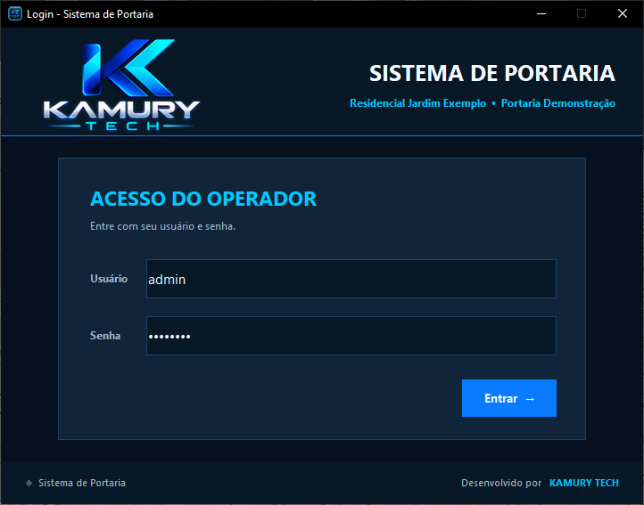 | 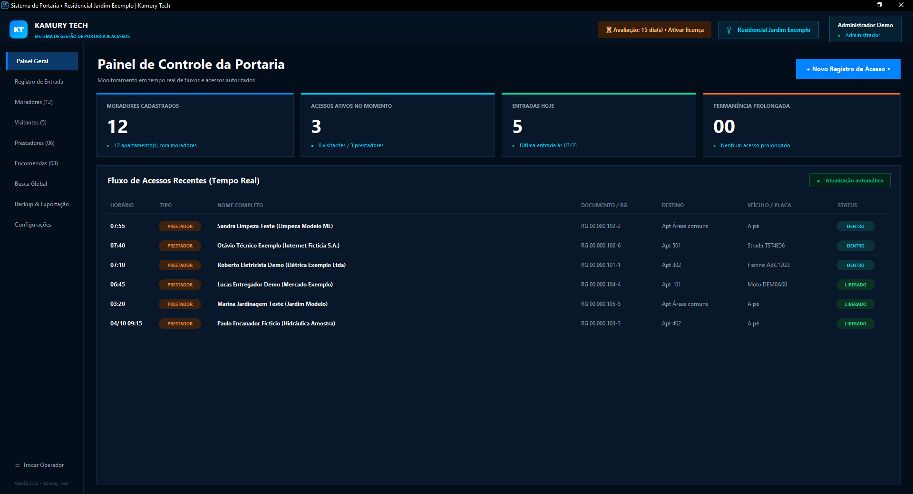 |

### Controle de acessos

| Registrar entrada | Acessos ativos |
|---|---|
| 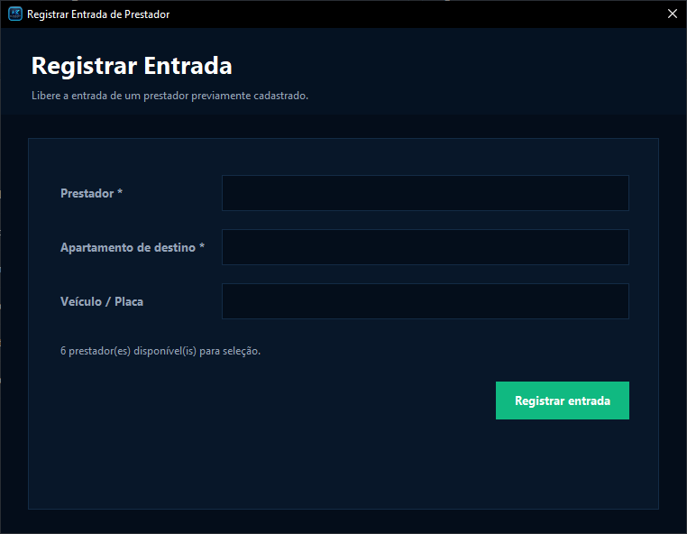 | 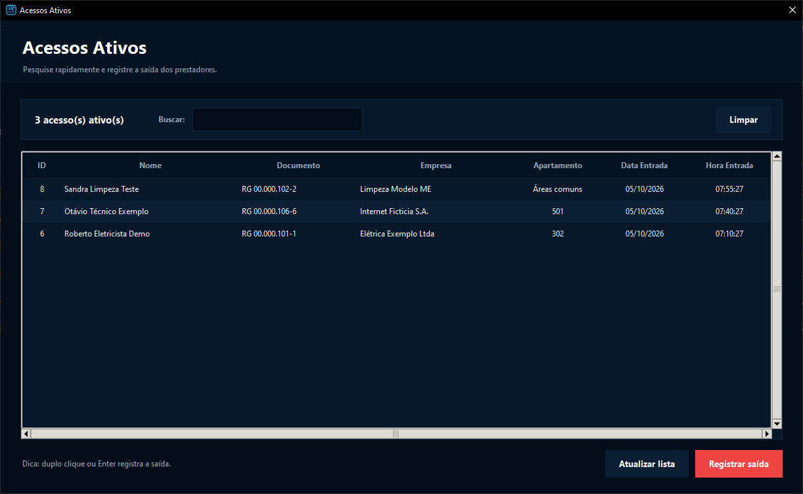 |

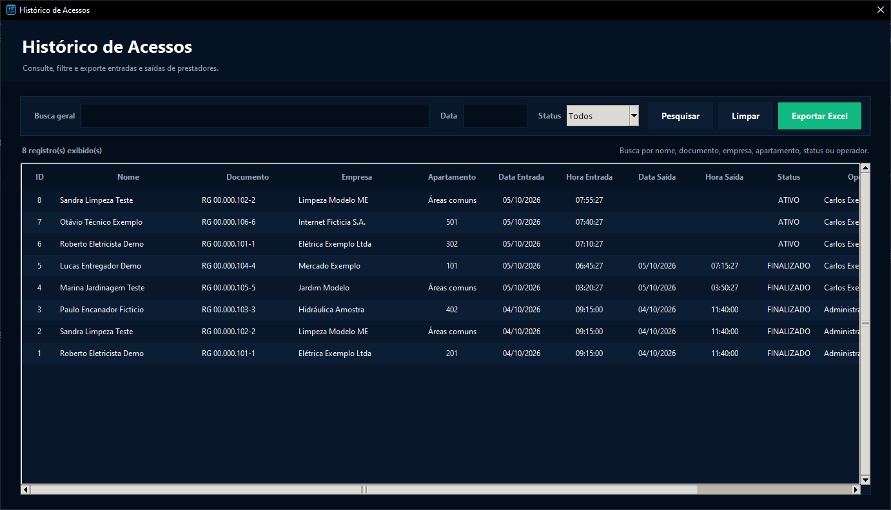

### Cadastros

| Moradores | Novo morador |
|---|---|
| 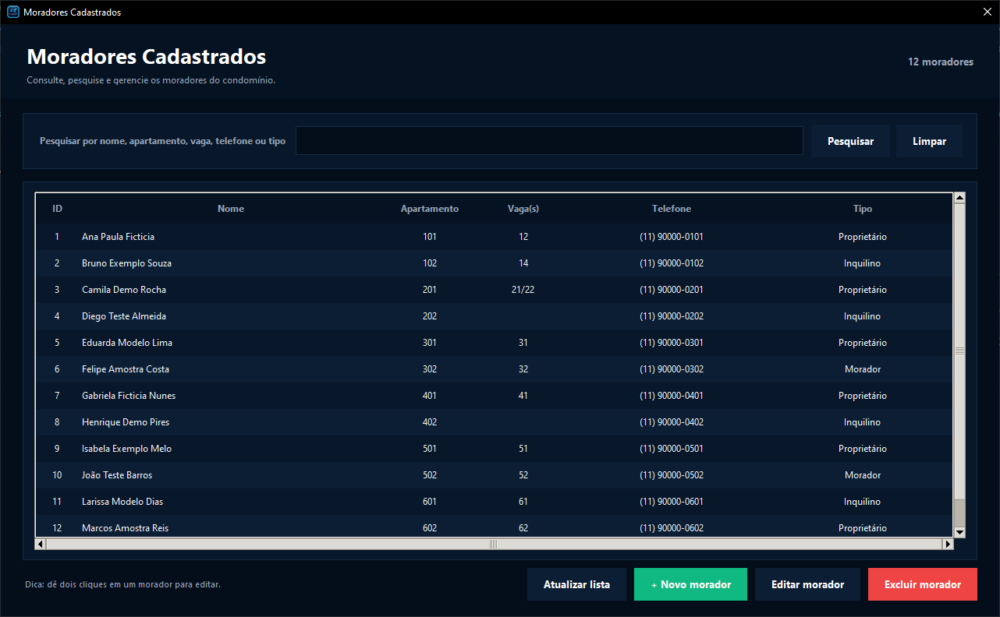 | 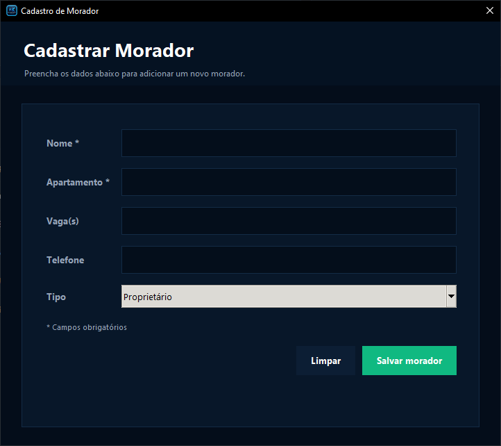 |

| Visitantes | Prestadores |
|---|---|
| 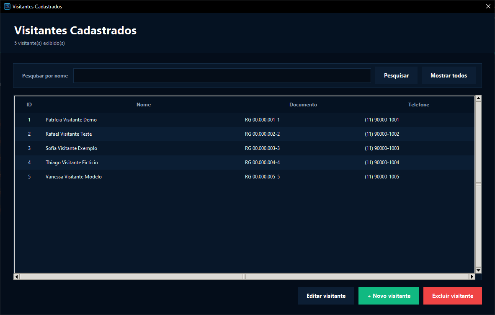 | 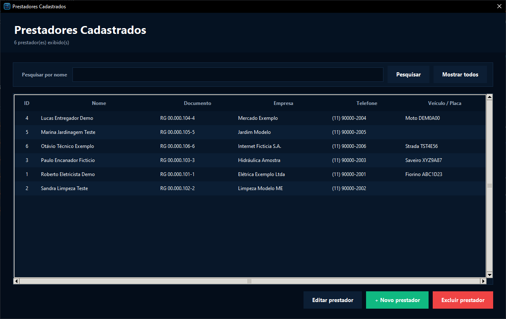 |

### Encomendas

| Gestão de encomendas | Nova encomenda |
|---|---|
| 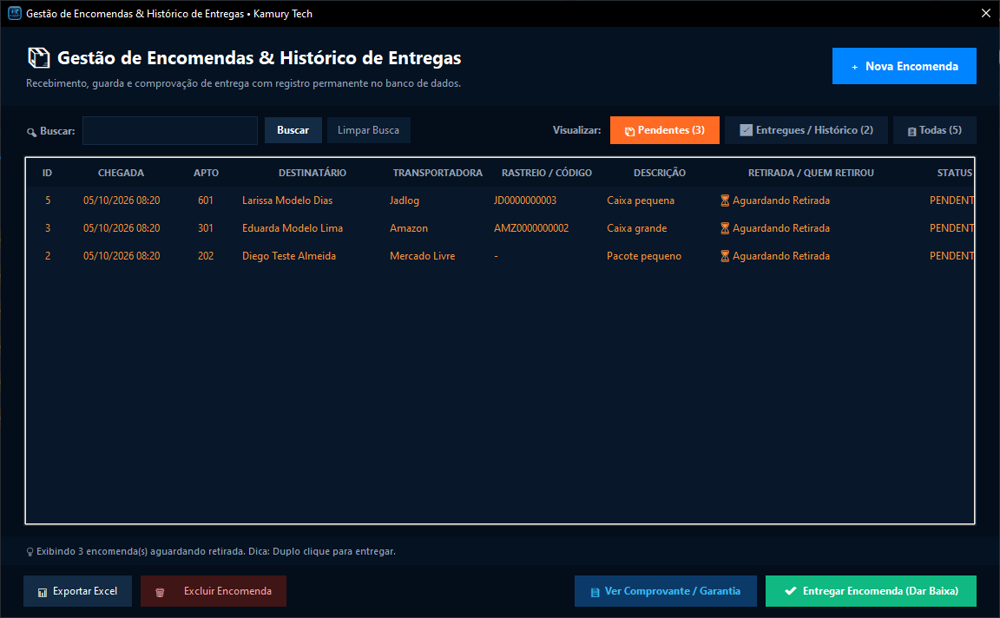 | 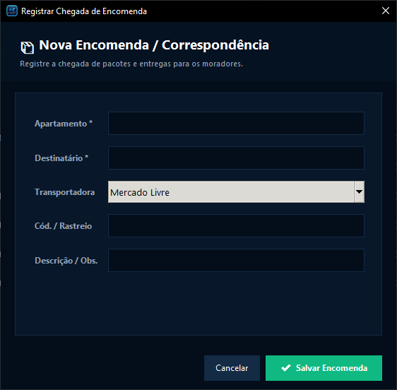 |

### Busca, administração e segurança dos dados

| Busca rápida | Operadores |
|---|---|
| 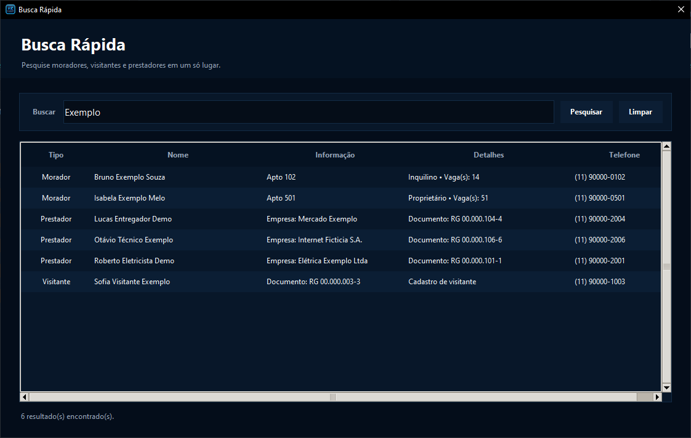 | 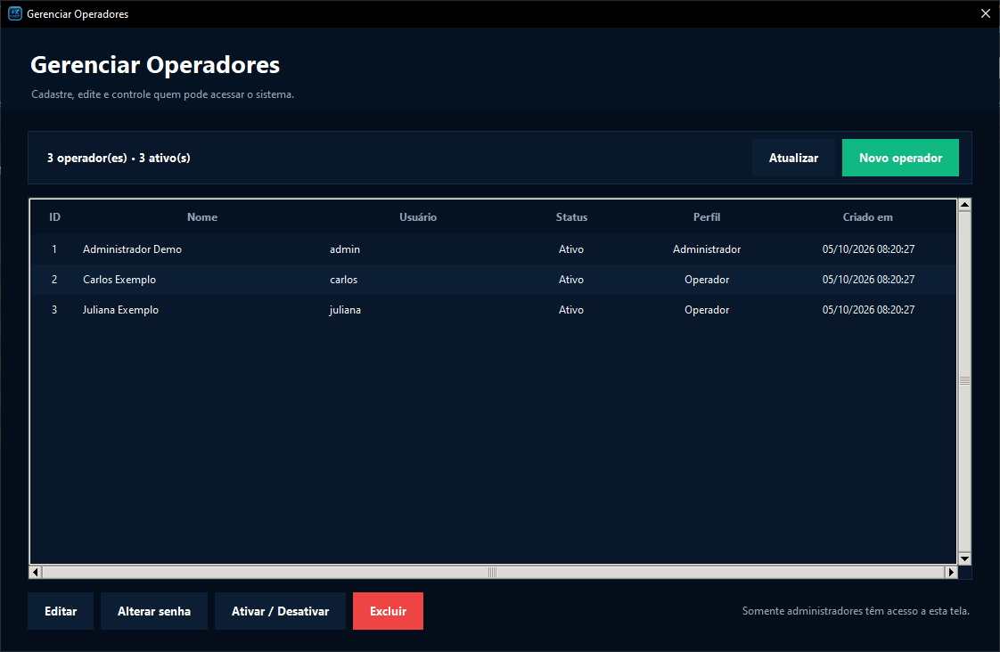 |

| Configurações do cliente | Backup e exportação |
|---|---|
| 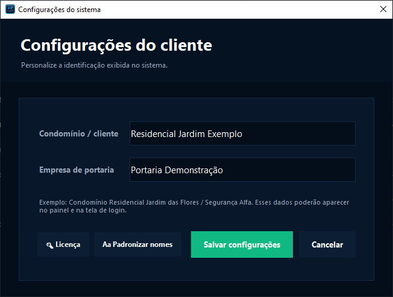 | 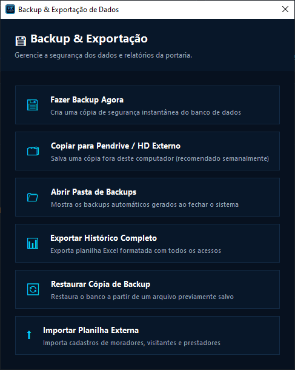 |

---

## 💻 Requisitos

- Windows 10 ou 11
- Instalador próprio: não precisa instalar Python nem banco de dados
- Funciona offline; os dados ficam no próprio computador da portaria

## 🛠️ Tecnologias

Python · Tkinter · SQLite

---

## 📞 Contato

Quer o sistema no seu condomínio ou uma demonstração? Fale com a **Kamury Tech**:

- ✉️ **E-mail:** [kamurytech@gmail.com](mailto:kamurytech@gmail.com)
- 📱 **Celular / WhatsApp:** [(41) 99118-6858](https://wa.me/5541991186858?text=Ol%C3%A1%2C%20vi%20o%20Sistema%20de%20Portaria%20no%20GitHub%20e%20quero%20saber%20mais.)

---

## 📄 Licença

Software proprietário da **Kamury Tech**. O sistema é distribuído com período de avaliação e ativação por chave de licença. Todos os direitos reservados.
